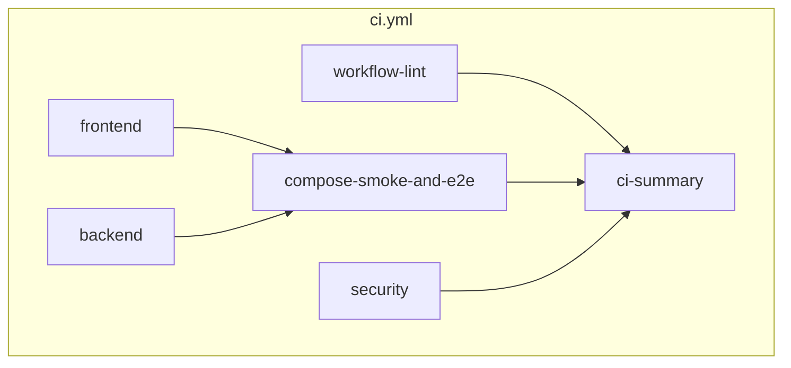

# Continuous integration (CI)

Single reference for how this repository is checked on **GitHub Actions**, what runs **locally**, and how **Dependabot** and **`act`** fit in.  
Implementation logs: [doc/implementation/2026-05-11-github-ci-and-act.md](doc/implementation/2026-05-11-github-ci-and-act.md), [doc/implementation/2026-05-11-production-docker-release.md](doc/implementation/2026-05-11-production-docker-release.md).

---

## Workflows

| File | Triggers | Purpose |
|------|----------|---------|
| [`.github/workflows/ci.yml`](.github/workflows/ci.yml) | Push to `main`, all `pull_request` | Lint workflows, build Bun workspaces, PHP tests + static analysis, Compose smoke + Cypress, security audits, rollup |
| [`.github/workflows/release.yml`](.github/workflows/release.yml) | Push tag `v*.*.*` | Build production image ([`docker/production/Dockerfile`](docker/production/Dockerfile)), smoke-test, push to **GHCR**, create GitHub Release with [`deploy/`](deploy/) assets |

**GitHub CodeQL** is intentionally **not** wired here for now (code scanning unused / unnecessary until the repo is public). Reintroduce via a `codeql.yml` workflow and enable **Code scanning** under repository settings when you want SARIF uploads.

### Global CI settings (`ci.yml`)

- **Concurrency**: `ci-ci.yml-<ref>`, `cancel-in-progress: true` so newer pushes supersede older runs.
- **Permissions**: `contents: read` (no elevated token for the main CI workflow).
- **Shell**: `bash` for all `run:` steps.

### Workflow: `release.yml` (GHCR + GitHub Release)

- **Trigger**: `push` tags matching **`vMAJOR.MINOR.PATCH`** (YAML: `v[0-9]+.[0-9]+.[0-9]+`).
- **Permissions**: `packages: write` (GHCR), `contents: write` (GitHub Release + attach files via `GITHUB_TOKEN`).
- **Steps**: `docker/login` → `docker build` [`docker/production/Dockerfile`](docker/production/Dockerfile) → smoke curls + JSON check on `/` bootstrap payload (Python one-liner), SPA paths, and `404` for `/info.php`, `/dev/`, `/coverage/` (and `/coverage`).
- **Publish**: `ghcr.io/<lowercase-github-repository>:<tag>` plus `latest`; attaches `deploy/docker-compose.traefik.yml`, `deploy/.env.example`, `deploy/README.md` via `softprops/action-gh-release@v2` (release notes autogenerated).

Operational detail is canonical in **[`deploy/README.md`](deploy/README.md)**.

---

## Job: `workflow-lint`

- **Runner**: `ubuntu-latest`
- **Steps**: checkout, then **actionlint** via container `docker.io/rhysd/actionlint:1.7.7` (validates `.github/workflows/*.yml`).

**Local equivalent**

```bash
docker run --rm -v "$PWD:/repo" -w /repo docker.io/rhysd/actionlint:1.7.7
```

Or use **`actionlint`** from `nix develop` ([`flake.nix`](flake.nix)).

---

## Job: `frontend`

- **Runner**: `ubuntu-latest`
- **Tooling**: [`oven-sh/setup-bun@v2`](https://github.com/oven-sh/setup-bun)
- **Commands** (in order):
  1. `bun install --frozen-lockfile` (workspaces under `apps/*`, `packages/*`; lockfile `bun.lock` at repo root)
  2. `bun run typecheck` → `tsc --noEmit`
  3. `bun run build` → [`build.ts`](build.ts) → `dist/{tutor,enroll,verify}/`
  4. `bun run build:compose` → static tree under `api/public/static-spa/` + `.htaccess` via [`scripts/write-spa-htaccess.ts`](scripts/write-spa-htaccess.ts)
- **Artifact**: **`static-spa`** — contents of `api/public/static-spa/` (used by `compose-smoke-and-e2e`).

---

## Job: `backend`

- **Runner**: `ubuntu-latest` (Docker available on GitHub-hosted runners)
- **Steps**:
  1. `docker compose build php` (image from [`docker/php/Dockerfile`](docker/php/Dockerfile))
  2. `docker compose run --rm --entrypoint composer php install --no-interaction --no-progress`  
     → `vendor/` lives in named volume `api_vendor`; app code is bind-mounted `./api` → `/var/www/html`.
  3. **Pest** (inside `php` service), with **PCOV** coverage and **Mailpit** env from [`docker-compose.yml`](docker-compose.yml) (`MAILPIT_INTEGRATION=1`, `MAILPIT_API_BASE`, `SMTP_*`):
     - `--coverage-html=coverage/html`
     - `--coverage-clover=coverage/clover.xml`
     - `--log-junit=coverage/junit.xml`
     - `--min=100` (bootstrap: 100 % of measured `api/src/`)
  4. **PHPStan**: `./vendor/bin/phpstan analyse --memory-limit=-1 --error-format=github` (annotations in the Actions UI).

**Artifacts**

| Name | Path on disk (after run) | Use |
|------|--------------------------|-----|
| `junit-php` | `api/coverage/junit.xml` | Test report importers |
| `coverage-clover-php` | `api/coverage/clover.xml` | Codecov / Sonar / GitLab |
| `coverage-html-php` | `api/coverage/html/` | Human-readable coverage site |

**Local equivalent** (matches most of this job; needs Docker):

```bash
nix develop -c bun run test:backend:coverage
nix develop -c bun run analyse:backend
```

---

## Job: `compose-smoke-and-e2e`

- **Needs**: `frontend`, `backend` (must both succeed so artifacts exist).
- **Runner**: `ubuntu-latest`
- **Flow**:
  1. Checkout, `setup-bun`, `bun install --frozen-lockfile` (for Cypress binary + workspace deps).
  2. Download **`static-spa`** → `api/public/static-spa/`.
  3. Download **`coverage-html-php`** → `api/coverage/html/` (so nginx can serve `/coverage/` like in dev).
  4. `docker compose up -d` (nginx `7123:80`, php-fpm, Mailpit).
  5. **HTTP smoke**: `curl` loop on `http://127.0.0.1:7123` for:
     - `/`, `/dev/`, `/info.php`, `/tutor/`, `/enroll/`, `/verify/`, `/coverage/`
  6. **Cypress**: [`cypress-io/github-action@v6`](https://github.com/cypress-io/github-action) with **Chrome**, `install: false`, command `bun run cypress:compose`  
     → sets `CYPRESS_BASE_URL=http://localhost:7123` (see [`package.json`](package.json)); specs are path-only ([`cypress.config.cjs`](cypress.config.cjs)).
  7. **Teardown**: `docker compose down --volumes` (always, even on failure).

**Local equivalent**

```bash
nix develop -c bun run build:compose
nix develop -c bun run docker:up
# wait for http://localhost:7123/tutor/
nix develop -c bun run cypress:compose
```

On **NixOS**, run Cypress from **`nix develop`** (see [.cursor/rules/cypress-test-runner.mdc](.cursor/rules/cypress-test-runner.mdc)).

---

## Job: `security`

- **Runner**: `ubuntu-latest`
- **Steps**:
  1. `bun install --frozen-lockfile` + **`bun audit`** (fails the job if Bun reports vulnerable deps).
  2. `docker compose build php`
  3. `composer install` + **`composer audit`** in the `php` container (fails on known advisories for locked deps).
  4. **Trivy** filesystem scan ([`aquasecurity/trivy-action@v0.36.0`](https://github.com/aquasecurity/trivy-action) (`v`-prefixed tags; older numeric-only tags were removed after Aqua’s 2025 tag migration)): `scan-type: fs`, skips heavy dirs, **`exit-code: "0"`** so findings are visible but do **not** fail CI (informational layer).

---

## Job: `ci-summary`

- **Needs**: all of `workflow-lint`, `frontend`, `backend`, `compose-smoke-and-e2e`, `security`
- **`if: always()`** so it runs even when another job fails.
- **Steps**:
  1. Writes a **markdown table** of each job’s `result` to **`$GITHUB_STEP_SUMMARY`** (visible on the workflow run summary page).
  2. **Fails the workflow** if any of those jobs is not **`success`** (includes **skipped** / **cancelled** / **failure** so the rollup is red when something did not complete successfully).

---

## Dependabot

[`.github/dependabot.yml`](.github/dependabot.yml) — **weekly** PRs, limit 10 open (where specified):

| Ecosystem | Directory | Notes |
|-----------|-----------|--------|
| `github-actions` | `/` | Action version bumps |
| `npm` | `/` | Tracks `package.json` / **`bun.lock`** at root (Bun uses npm ecosystem in Dependabot) |
| `composer` | `/api` | [`api/composer.json`](api/composer.json) / `composer.lock` |
| `docker` | `/docker/php` | Base image in [`docker/php/Dockerfile`](docker/php/Dockerfile) |

---

## Nix dev shell tools

[`flake.nix`](flake.nix) adds to the default shell:

- **`act`** — run workflows locally against Docker
- **`actionlint`** — same linter as CI (optional CLI; CI uses the pinned Docker image)
- **`bun`**, **`docker-compose`**, **`php84`**, **`composer`**, **`cypress`** (unchanged)

```bash
nix flake check
nix develop -c act --version
nix develop -c actionlint -version
```

---

## Root `package.json` CI scripts

| Script | What it does |
|--------|----------------|
| `ci:local` | `typecheck` → `build` → `build:compose` → `test:backend:coverage` → `analyse:backend` (Docker required for PHP parts; **no** Cypress unless you run it separately) |
| `ci:act:list` | `act --list` |
| `ci:act` | `act pull_request --verbose` |

**Typical local rehearsal**

```bash
nix develop -c bun run ci:local
nix develop -c bun run ci:act:list
nix develop -c bun run ci:act
```

### Using `act` safely

- Needs a working **Docker** daemon and enough disk/RAM for Linux job images plus Compose/Cypress pulls.
- Dependabot alerts and some GitHub-only integrations will **not** match `act` 1:1.
- Prefer **`act -j workflow-lint`** or **`act -j frontend`** for quick iteration before a full **`act pull_request`**.

---

## Mental model



---

## Related files

| Path | Role |
|------|------|
| [`.github/workflows/ci.yml`](.github/workflows/ci.yml) | Main CI pipeline |
| [`.github/dependabot.yml`](.github/dependabot.yml) | Dependency update PRs |
| [`docker-compose.yml`](docker-compose.yml) | CI-local stack (nginx, php, mailpit) |
| [`package.json`](package.json) | `ci:*` scripts and `cypress:compose` |
| [`flake.nix`](flake.nix) | `act`, `actionlint`, Bun, Compose, Cypress |
| [`README.md`](README.md) | Short CI pointer + onboarding |

---

## Optional follow-ups

- Add workflow **badges** in [`README.md`](README.md) once the workflow name and default branch are stable.
- When the repository is **public** and you want **Code scanning**, add `codeql.yml` (e.g. `javascript` for JS/TS) and enable code scanning in repository settings; optionally add **PHP** to the CodeQL matrix if supported.
