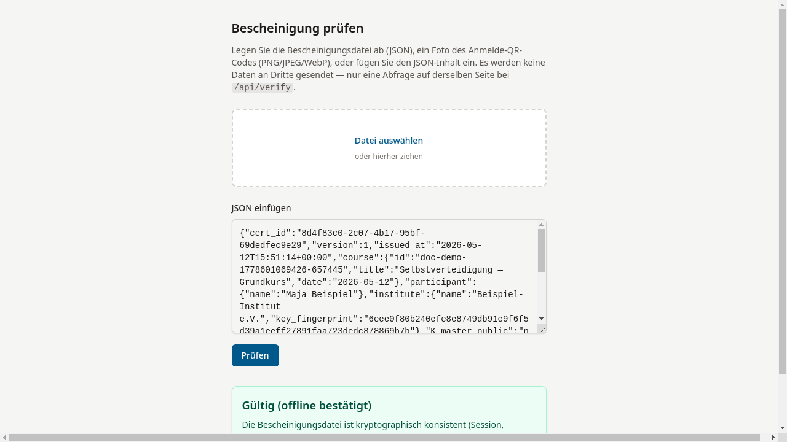

# Offline prüfen

## Ziel

Eine Bescheinigungsdatei (JSON) oder ein Foto des QR-Codes wird hochgeladen
und vollständig kryptographisch geprüft — inklusive Signatur- und
Fingerabdruck-Verifikation.

## Schritt-für-Schritt

1. `/verify/` im Browser aufrufen.

2. Eine der drei Möglichkeiten wählen:

    - **Datei ablegen** — Die `.json`-Datei in die Drop-Zone ziehen
      oder auf **Datei auswählen** klicken.
    - **QR-Code-Foto** — Ein Foto (PNG/JPEG/WebP) des QR-Codes hochladen.
      Das System erkennt den QR-Code automatisch.
    - **JSON einfügen** — Den JSON-Inhalt in das Textfeld kopieren
      und auf **Prüfen** klicken.

3. Das System prüft lokal:

    - Die Sitzungs-Signatur (`session_sig`)
    - Die Bescheinigungs-Signatur (`certificate_sig`)
    - Den Instituts-Fingerabdruck

4. Zusätzlich fragt es den Server nach dem Sperrstatus.

    

!!! warning "Hinweis"
    Die kryptographische Prüfung läuft vollständig im Browser ab.
    Es werden keine Bescheinigungsdaten an Dritte gesendet — lediglich
    der Sperrstatus wird beim Server abgefragt.

## Was als Nächstes?

[Ergebnis anzeigen](ergebnis-anzeigen.md) — Die vier möglichen
Prüfergebnisse im Detail verstehen.
