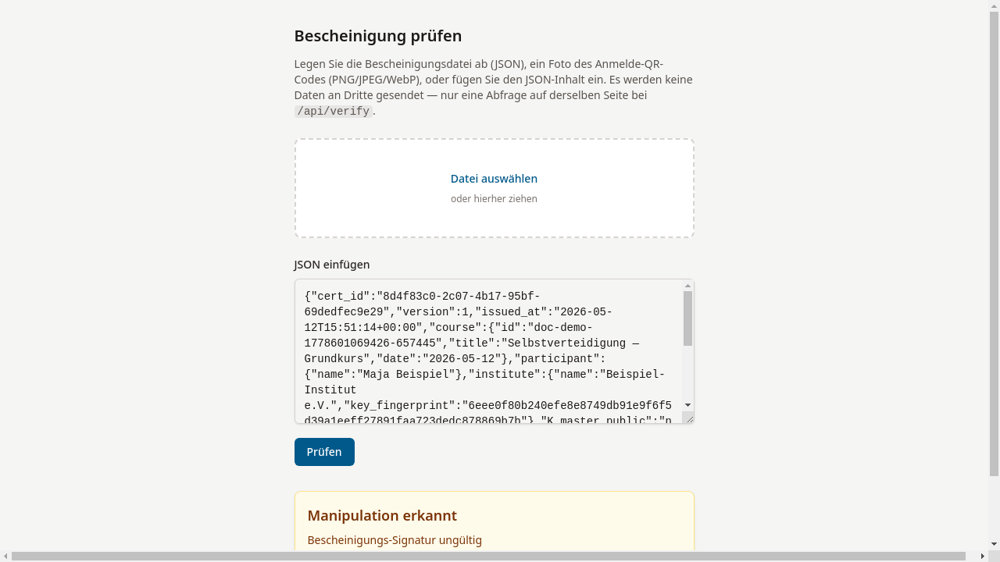
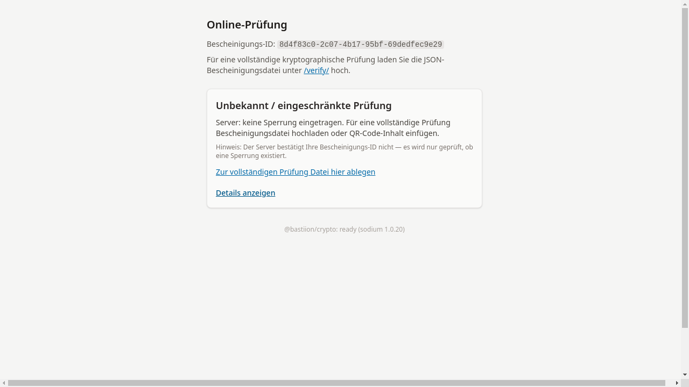
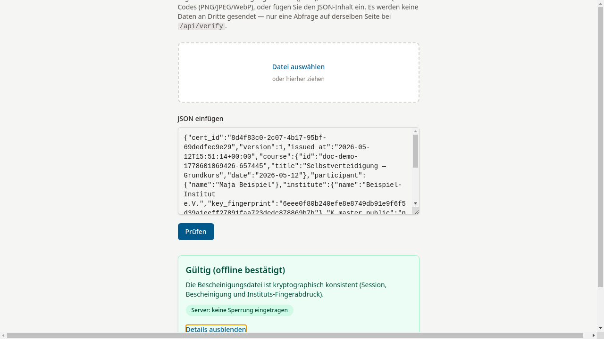

# Ergebnis anzeigen

## Die vier Prüfergebnisse

Das System kennt vier mögliche Ergebnisse:

### Gültig (grün)

Die Bescheinigung ist kryptographisch konsistent: Session-Signatur,
Bescheinigungs-Signatur und Instituts-Fingerabdruck stimmen überein.
Der Server hat keine Sperrung eingetragen.

### Gesperrt (rot)

Die Bescheinigung wurde widerrufen. Sperrdatum und
Grund werden angezeigt.

### Manipulation erkannt (gelb)

Mindestens eine Signatur oder der Fingerabdruck stimmt nicht überein.
Die Bescheinigung wurde möglicherweise verändert.

### Unbekannt / eingeschränkte Prüfung (grau)

Es liegt keine Bescheinigungsdatei vor (nur eine ID-Abfrage).
Der Server kann lediglich mitteilen, ob ein Widerruf vorliegt.

## Details anzeigen

Unter jedem Ergebnis kann über **Details anzeigen** der vollständige
JSON-Inhalt der Bescheinigung eingesehen werden.

