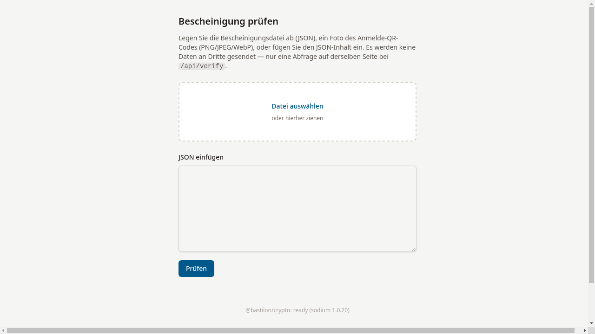

# Prüfende Stelle

Prüfende Stellen stellen fest, ob eine vorliegende Bescheinigung
echt und gültig ist. Das System bietet zwei Wege:

- **Online-Prüfung** — per Bescheinigungs-ID den Sperrstatus abfragen
- **Offline-Prüfung** — JSON-Datei oder QR-Code-Foto hochladen und die
  kryptographischen Signaturen lokal prüfen

## Ablauf

1. [Online prüfen](01-online-pruefen.md) — Sperrstatus über die ID abfragen
2. [Offline prüfen](02-offline-pruefen.md) — Datei oder QR-Code-Foto hochladen

## Hintergrund

- [Widerruf erklärt](widerruf-erklaert.md) — Was eine Sperrung bedeutet
- [Ergebnis anzeigen](ergebnis-anzeigen.md) — Die vier Prüfergebnisse im Detail

