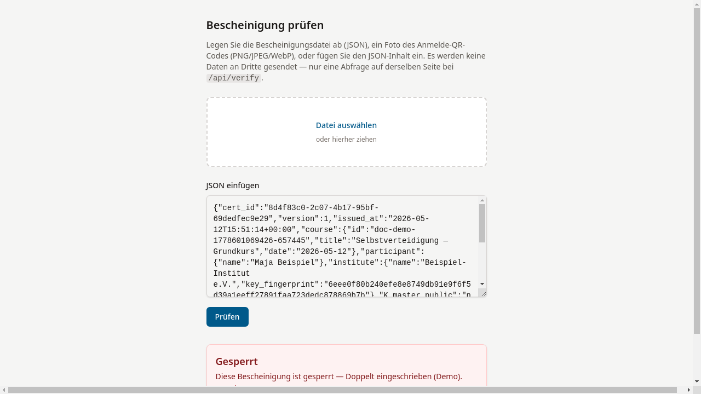

# Widerruf erklärt

## Was ist ein Widerruf?

Ein Widerruf (Sperrung) ist die signierte Rücknahme einer
Bescheinigung. Die Tutor:in signiert den Widerruf mit demselben
K_master, mit dem die Sitzung ursprünglich angelegt wurde.

## Wie erkennt man einen Widerruf?

- **Online:** Die Prüfseite zeigt den Status **„Gesperrt"** in Rot an,
  zusammen mit dem Sperrdatum und dem angegebenen Grund.

    

- **Offline:** Wird die Bescheinigungsdatei hochgeladen,
  prüft das System zusätzlich die Sperr-Signatur kryptographisch.
  Bei erfolgreicher Prüfung erscheint der Hinweis
  **„Sperr-Signatur offline geprüft"**.

## Ist ein Widerruf umkehrbar?

Nein. Ein einmal signierter und an den Server übermittelter Widerruf
ist endgültig. Eine Bescheinigung kann nicht „ent-widerrufen" werden.

## Was passiert bei Datenverlust auf dem Server?

Widerruf-Einträge werden in der Datenbank des Servers gespeichert.
Fällt der Server ohne Datensicherung aus, gehen diese Einträge verloren —
widerrufene Bescheinigungen würden danach bei einer Online-Prüfung
wieder als nicht gesperrt erscheinen.

!!! warning "Bekannte Einschränkung"
    Das System versendet beim Widerruf keine Bestätigungs-E-Mail.
    Eine externe Kopie des Widerrufsdokuments entsteht also nicht
    automatisch. Betreiber sollten regelmäßige Backups der
    SQLite-Datenbank einplanen; Tutor:innen sollten Widerrufe
    zusätzlich außerhalb des Systems festhalten.
    Ein E-Mail-Versand des signierten Widerrufsdokuments ist
    derzeit noch nicht implementiert.
