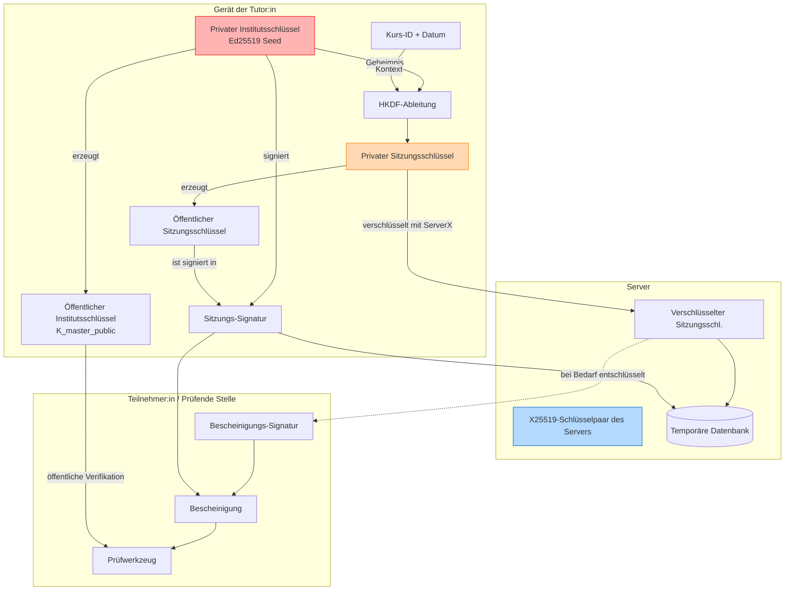

# Technischer Hintergrund — Kryptographie

Dieses Dokument erklärt die kryptographischen Konzepte, Algorithmen und Schlüssel,
die in diesem System eingesetzt werden. Es richtet sich an Interessierte ohne
tiefe Vorkenntnisse — es wird erklärt, *wie* und *warum* hier signiert wird.

---

## 1. Das große Bild: Public-Key-Kryptographie

Im Kern des Systems steht **Public-Key-Kryptographie** (asymmetrische Kryptographie).
Statt eines gemeinsamen Passworts gibt es zwei Schlüssel:

- **Privater Schlüssel**: Wird geheimgehalten. Damit werden digitale „Signaturen" erstellt.
- **Öffentlicher Schlüssel**: Wird frei geteilt. Jeder kann damit prüfen, ob eine Signatur
  wirklich mit dem passenden privaten Schlüssel erstellt wurde.

**Weiterführendes (englisch)**:

- [Digital Signatures Demo](https://fixmycert.com/demos/digital-signatures) — Interaktive Visualisierung von Signatur und Verifikation
- [Public-Key Cryptography (Cloudflare)](https://www.cloudflare.com/learning/ssl/how-does-public-key-encryption-work/) — Verständlicher Überblick
- [The Animated Elliptic Curve](https://curves.xargs.org/) — Anschauliche Erklärung der elliptischen Kurven-Mathematik

In diesem System wird damit nachgewiesen, dass eine Bescheinigung wirklich von
einer bestimmten Tutor:in ausgestellt wurde — ohne dass der Server den privaten
Schlüssel dauerhaft kennen muss.

---

## 2. Schlüssel und Seeds

### Ed25519-Seed

- **Was es ist**: Eine 32 Byte lange geheime Zufallszahl. Aus diesem „Seed" wird
  ein vollständiges Ed25519-Schlüsselpaar (privat + öffentlich) erzeugt.
- **Einsatz**: Der Seed ist das Herzstück des Vertrauens — die `.key`-Datei
  der Tutor:in enthält genau diesen Wert.
- **Warum Ed25519**: Moderner Standard, schnell und sicher. Alternativen wie RSA
  oder ECDSA sind schwieriger korrekt zu implementieren.

### Zwei Schlüsselebenen: Institutsschlüssel und Sitzungsschlüssel

Das System verwendet bewusst nicht nur einen einzigen Schlüssel, sondern trennt
die Verantwortung:

1. **Institutsschlüssel (`K_master`)**: Die langfristige Identität der Tutor:in.
   Er existiert ausschließlich lokal im Browser-Tab und gelangt niemals auf den Server.
2. **Sitzungsschlüssel (`K_course`)**: Ein kurzlebiger, pro Sitzung abgeleiteter Schlüssel.
   Er wird temporär auf dem Server gespeichert und nach Ablauf der Sitzung wertlos.

**Warum diese Trennung?** Falls der Server kompromittiert wird, erhält ein Angreifer
nur einen bereits abgelaufenen Sitzungsschlüssel — der Institutsschlüssel war
zu keinem Zeitpunkt auf dem Server.

---

## 3. Kryptographische Algorithmen und Werkzeuge

### libsodium

Eine moderne, leicht nutzbare Softwarebibliothek für Verschlüsselung, Signaturen
und Hashing. Sie abstrahiert die komplexe Mathematik und bietet sichere Standardwerte.
Im System wird sie über `sodium_compat` (PHP-Backend) und die WebCrypto-API
(Browser-Frontend) eingesetzt.

Dokumentation: [doc.libsodium.org](https://doc.libsodium.org/)

### HKDF (HMAC-based Key Derivation Function)

Nimmt ein starkes Geheimnis (hier: `K_master`) und leitet daraus deterministisch
einen neuen, eigenständigen Schlüssel ab — angereichert mit Kontextinformationen
wie Kurs-ID und Datum. Damit wird `K_course` ohne dauerhafte Speicherung berechnet.

### HMAC (Hash-based Message Authentication Code)

Kombiniert einen geheimen Schlüssel mit einer Nachricht und erzeugt daraus einen
Prüfwert. Das System nutzt HMAC für selbst-verifizierende Einschreibe-Links:
Der Server muss keinen Link in der Datenbank nachschlagen — er rechnet den HMAC
des Links nach und vergleicht.

### BLAKE2b-256

Eine kryptographische Hashfunktion, die beliebige Daten in einen fixen 256-Bit-Wert
umwandelt — schneller als SHA-256 und ebenso sicher. Wird eingesetzt, um einen
kompakten **Fingerabdruck** des öffentlichen Institutsschlüssels zu erzeugen,
der visuell verglichen werden kann.

### X25519

Ein Algorithmus für die Schlüsseleinigung (Elliptic-Curve Diffie-Hellman, ECDH).
Er ermöglicht es zwei Parteien, über einen unsicheren Kanal ein gemeinsames Geheimnis
auszuhandeln. Wenn die Tutor:in den Sitzungsschlüssel an den Server übermittelt,
verschlüsselt sie ihn mit dem öffentlichen X25519-Schlüssel des Servers — nur
der Server kann ihn entschlüsseln.

- [X25519 Key Exchange: Hands-on Interactive](https://x25519.xargs.org/) — Schritt-für-Schritt-Rechner, der den Schlüsselaustausch demonstriert
- [The Animated Elliptic Curve](https://curves.xargs.org/) — Anschauliche Visualisierung der Mathematik hinter Curve25519
- [Elliptic Curve Diffie-Hellman (Wikipedia)](https://de.wikipedia.org/wiki/Elliptic_Curve_Diffie-Hellman) — Überblick und mathematischer Hintergrund

---

## 4. Die zwei Signaturen einer Bescheinigung

Jede Bescheinigung trägt **zwei** digitale Signaturen, die zusammen ihre Echtheit belegen:

### 1. Sitzungs-Signatur (`session_sig`)

- **Signiert von**: `K_master` (privater Institutsschlüssel, nur auf dem Gerät der Tutor:in)
- **Aussage**: „Ich, der Institutsschlüssel, autorisiere diesen temporären Sitzungsschlüssel,
  Bescheinigungen für diesen Kurs in diesem Zeitfenster auszustellen."

### 2. Bescheinigungs-Signatur (`certificate_sig`)

- **Signiert von**: `K_course` (Sitzungsschlüssel, auf dem Server)
- **Aussage**: „Ich, der Sitzungsschlüssel, bestätige, dass diese Person an diesem Kurs
  teilgenommen hat."

Durch Prüfung beider Signaturen lässt sich mathematisch nachweisen, dass eine
Bescheinigung von einer autorisierten Tutor:in stammt — ohne dass die Tutor:in
jede einzelne Bescheinigung manuell signieren muss.

---

## 5. Zusammenspiel aller Komponenten

