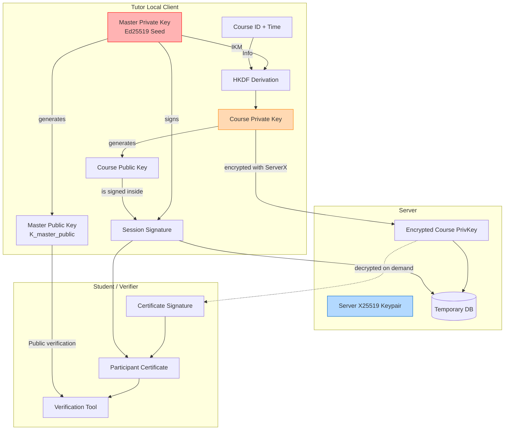

# Glossary — Cryptography in this project

Plain-language meanings for the cryptographic concepts, algorithms, and keys used in this repository. This guide is written for beginners and intermediate developers to understand *how* and *why* things are signed or encrypted here.

---

## 1. The Big Picture: Public-Key Cryptography

At the core of this project is **Public-Key Cryptography** (Asymmetric Cryptography). Instead of one password, you have two keys:
- **Private Key**: Kept secret. Can create digital "signatures".
- **Public Key**: Shared with the world. Anyone can use it to verify that a signature was really made by the Private Key.

**Interactive Resources**:
- [Digital Signatures Demo](https://fixmycert.com/demos/digital-signatures) - Interactive visualization of how signing and verification works step-by-step
- [Digital Signatures Explained with Lab](https://www.decodedsecurity.com/p/digital-signatures-explained-with) - 5-minute hands-on tutorial
- [Public-Key Cryptography Guide (Cloudflare)](https://www.cloudflare.com/learning/ssl/how-does-public-key-encryption-work/) - High-level overview
- [The Animated Elliptic Curve](https://curves.xargs.org/) - Beautiful interactive explanation of elliptic curve math

In our project, we use this to prove that a certificate was really issued by a specific tutor, without the server needing to hold the tutor's secret key permanently.

---

## 2. Keys and Seeds in this Project

### Ed25519 Seed
- **What it is**: A 32-byte secret random number. From this "seed", a full Ed25519 Private/Public key pair is generated.
- **Project use**: The tutor's master password/secret is turned into this seed. It's the ultimate root of trust.
- **Alternatives**: RSA (too slow/bulky), ECDSA (harder to implement securely). Ed25519 is the modern standard for fast, secure signatures.
- **Learn more**: 
  - [Ed25519 Deep Dive](https://cendyne.dev/posts/2022-03-06-ed25519-signatures.html) - Detailed technical walkthrough
  - [Ed25519 Quirks: Creating and Verifying Signatures](https://quirks.ed25519.info/basics/) - Practical guide with examples

### The Two Public Keys: Master Key vs Course Key
We don't use just one key for everything. We split the risk:
1. **Master Key (`K_master_public` & `K_master_private`)**: The tutor's main identity. It lives *only* on the tutor's local laptop. It is long-lived.
2. **Course Key (`K_course_public` & `K_course_private`)**: A temporary, single-use key derived just for one specific course session. It is uploaded to the server temporarily.

**Why?** If the server is hacked, the attacker only gets a temporary Course Key that expires anyway. They cannot steal the Master Key, because it was never on the server!

---

## 3. Cryptographic Tools & Algorithms

### libsodium (often just "sodium")
- **What it is**: A modern, easy-to-use software library for encryption, decryption, signatures, and password hashing.
- **Project use**: We use it via `sodium_compat` in PHP and `@bastiion/crypto` (or WebCrypto/libsodium.js) on the frontend. It abstracts away the scary math and gives us safe defaults.
- **Learn more**: [Official Libsodium Documentation](https://doc.libsodium.org/) - Comprehensive guides and API reference

### HKDF with IKM (Initial Keying Material)
- **What it is**: An **H**MAC-based **K**ey **D**erivation **F**unction. It takes a master secret (IKM) and mathematically "stretches" or "derives" a new, safe, unique key from it based on some context (like the course ID and date).
- **Project use**: The local client uses HKDF to deterministically generate the temporary `K_course` from the `K_master` without storing the course key permanently.
- **Alternatives**: PBKDF2, Argon2 (used for passwords, but HKDF is better for deriving cryptographic keys from an already strong secret).
- **Learn more**: 
  - [How to use HKDF to derive new keys](https://cendyne.dev/posts/2023-01-30-how-to-use-hkdf.html) - Practical tutorial with pitfalls
  - [Best Practices for Key Derivation](https://blog.trailofbits.com/2025/01/28/best-practices-for-key-derivation/) - Trail of Bits guide with animations
  - [Getting to Know HKDF](https://www.nearform.com/insights/getting-to-know-hkdf) - Beginner-friendly explanation

### HMAC
- **What it is**: **H**ash-based **M**essage **A**uthentication **C**ode. A way to mix a secret key with a message and hash them together. It proves both data integrity and authenticity.
- **Project use**: Used by the server to create self-verifying enrollment links (`token = course_id + valid_until + HMAC(server_secret, course_id + valid_until)`). The server doesn't need a database to know a link is valid; it just checks the HMAC!
- **Alternatives**: JWT (JSON Web Tokens) are similar but heavier. We use a simple HMAC for minimal overhead.

### BLAKE2b-256
- **What it is**: A cryptographic hashing function that scrambles any data into a fixed-size 256-bit string. It is faster than MD5 or SHA-256 and highly secure.
- **Project use**: Used to create a short "fingerprint" of the Master Public Key (`K_master_public_fingerprint`). This makes it easier to reference the tutor's identity compactly.
- **Alternatives**: SHA-256 or SHA-3. We chose BLAKE2b-256 because it is the default, highly-optimized hash in libsodium.
- **Learn more**: 
  - [BLAKE2 on Wikipedia](https://en.wikipedia.org/wiki/BLAKE_(hash_function)) - Overview and history
  - [SHA-256 vs BLAKE2: Comparative Analysis](https://www.hash.tools/115/cryptographic-algorithms/13927/comparative-analysis-of-hash-functions-sha-256-vs-blake2) - Speed and security comparison

### X25519
- **What it is**: An algorithm for Elliptic-Curve Diffie-Hellman (ECDH) key agreement. It allows two parties to securely agree on a shared secret over an insecure channel.
- **Project use**: When the tutor uploads the temporary Course Key to the server, it encrypts it using the server's X25519 public key. This ensures *only* the server can decrypt and use the Course Key.
- **Learn more**: 
  - [X25519 Key Exchange: Hands-on Interactive](https://x25519.xargs.org/) - Step-by-step calculator demonstrating key exchange
  - [The Animated Elliptic Curve](https://curves.xargs.org/) - Visual explanation of the math behind Curve25519
  - [Elliptic-curve Diffie–Hellman (Wikipedia)](https://en.wikipedia.org/wiki/Elliptic-curve_Diffie%E2%80%93Hellman) - Overview and mathematical background

---

## 4. The Signatures

When a student receives a certificate, how do they know it's valid? The certificate contains **two** digital signatures to prove authenticity:

### 1. The Session Signature (`session_sig`)
- **Signed by**: `K_master_private` (on the tutor's laptop)
- **What it says**: "I, the Master Key, authorize this temporary Course Key to issue certificates for this specific course and time window."

### 2. The Certificate Signature (`certificate_sig`)
- **Signed by**: `K_course_private` (on the server, right when the student clicks the link)
- **What it says**: "I, the Course Key, certify that *John Doe* participated in this course today."

By checking both signatures, a verifier mathematically proves that John Doe attended a course authorized by the actual tutor, without the tutor having to manually click "sign" for every single student!

---

## 5. How it all fits together

Here is a visual representation of how the keys and signatures interact:

