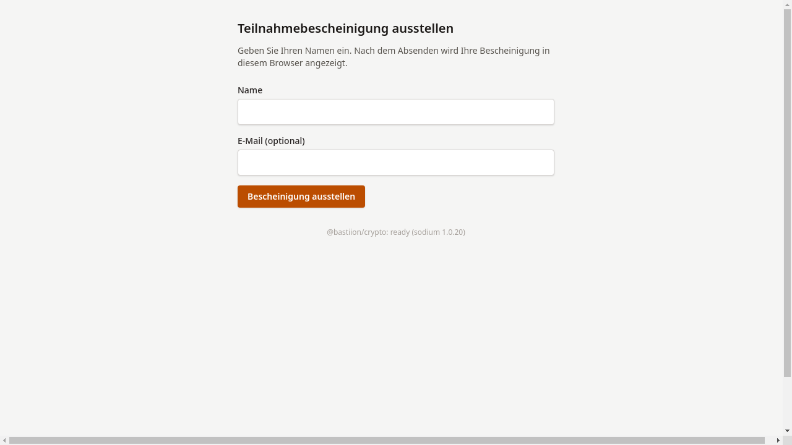

# Link öffnen

## Ziel

Der Einschreibe-Link, den die Kursleitung mitgeteilt hat, wird im Browser
aufgerufen und das Anmeldeformular erscheint.

## Schritt-für-Schritt

1. Den Einschreibe-Link im Browser öffnen.
   Die Adresse hat die Form `/enroll/<token>`.

2. Es erscheint ein kurzes Formular: Name (Pflichtfeld)
   und optional eine E-Mail-Adresse.

    

!!! warning "Hinweis"
    Der Einschreibe-Link ist nur bis zum von der Tutor:in festgelegten
    Datum gültig. Ist das Anmeldefenster abgelaufen, erscheint
    eine entsprechende Meldung.
    Siehe [Link abgelaufen](link-abgelaufen.md).

## Was als Nächstes?

[Bescheinigung erhalten](02-bescheinigung-erhalten.md) —
Name eingeben und Bescheinigung abrufen.
