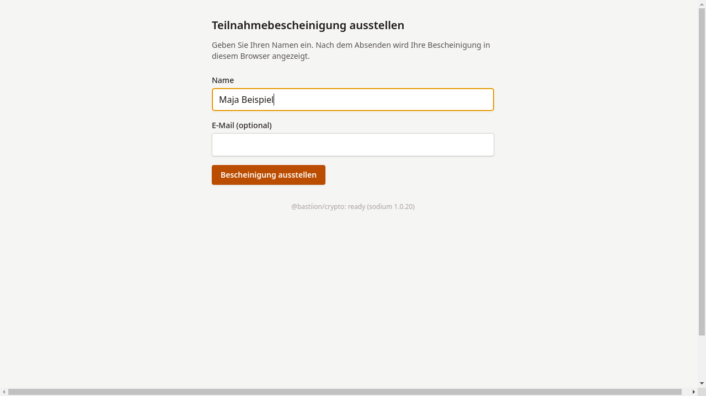
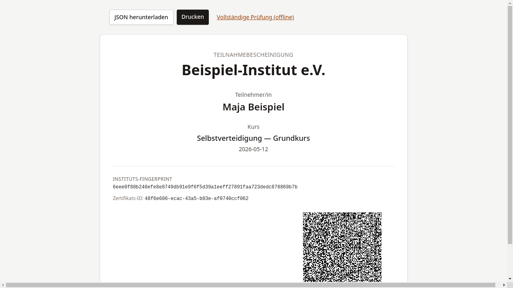

# Bescheinigung erhalten

## Ziel

Nach Eingabe des Namens wird die kryptographisch signierte Bescheinigung
direkt im Browser angezeigt.

## Schritt-für-Schritt

1. Den vollständigen Namen in das Feld **Name** eintragen.
   Optional kann eine E-Mail-Adresse angegeben werden.

    

2. Auf **Bescheinigung ausstellen** klicken. Das System sendet die Angaben
   an den Server, der die Bescheinigung mit dem Sitzungsschlüssel signiert.

3. Bei Erfolg erscheint die Bescheinigungsansicht mit:

    - Name und Kursdaten
    - dem Instituts-Fingerabdruck
    - einem QR-Code (siehe [QR-Code erklärt](qr-code-erklaert.md))

    

!!! warning "Hinweis"
    Falls ein Fehler auftritt (z. B. „Server nicht erreichbar"),
    kann über **Erneut versuchen** ein neuer Versuch gestartet werden.
    Bei wiederholten Problemen ist die Kursleitung zu kontaktieren.

## Was als Nächstes?

[Bescheinigung sichern](03-bescheinigung-sichern.md) — Datei
herunterladen oder ausdrucken.
