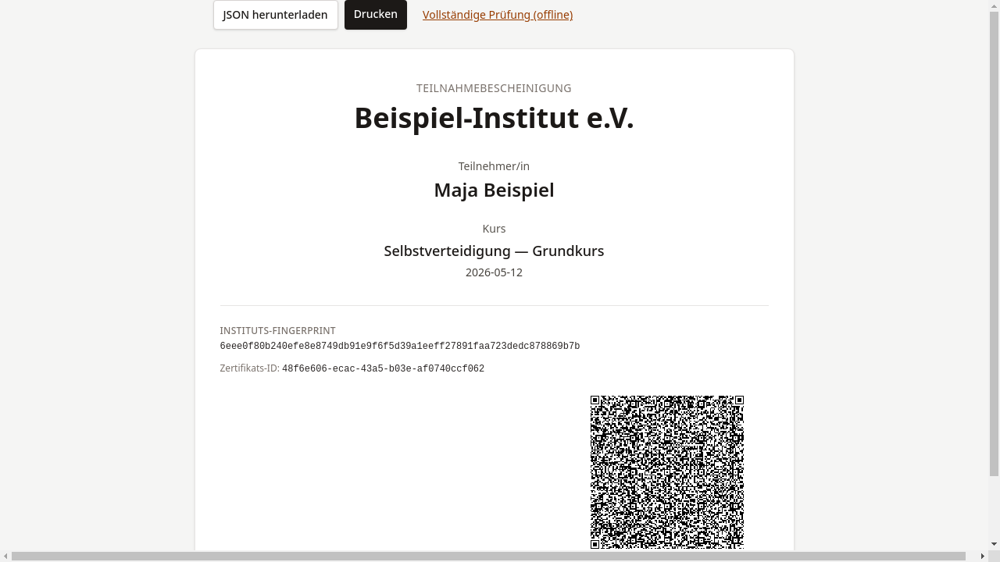

# Bescheinigung sichern

## Ziel

Die Bescheinigung wird als JSON-Datei heruntergeladen oder ausgedruckt —
als dauerhafter Nachweis.

## Schritt-für-Schritt

1. Unterhalb der Bescheinigungsansicht finden sich zwei Aktionen:

    

2. **JSON herunterladen** — Den Download-Button anklicken.
   Die Datei `bescheinigung-<ID>.json` wird auf dem Gerät gespeichert.
   Diese Datei kann später zur
   [Prüfung](../pruefung/01-online-pruefen.md) verwendet werden.

3. **Drucken** — Den Drucken-Button anklicken, um den
   Druckdialog des Browsers zu öffnen. Die Druckansicht
   enthält alle relevanten Informationen und den QR-Code.

!!! warning "Hinweis"
    Die JSON-Datei sollte an einem sicheren Ort gespeichert werden.
    Sie ist der kryptographische Nachweis und kann jederzeit — auch
    offline — geprüft werden.

## Was als Nächstes?

Die Bescheinigung ist gesichert. Bei Bedarf kann sie über
die [Prüfseite](../pruefung/01-online-pruefen.md) verifiziert
oder der [QR-Code](qr-code-erklaert.md) weitergegeben werden.
