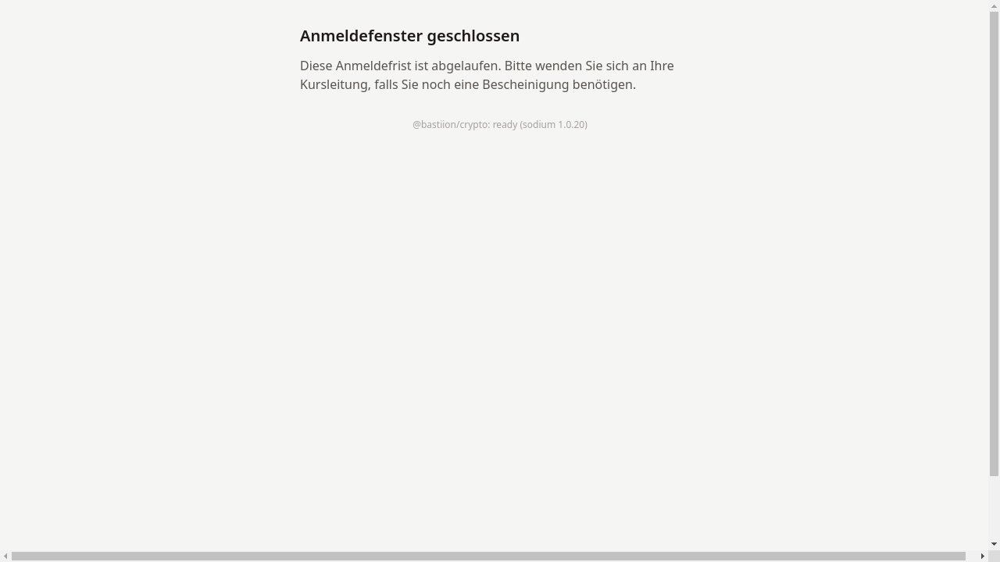

# Link abgelaufen

## Was bedeutet „Anmeldefenster geschlossen"?

Wird ein Einschreibe-Link aufgerufen, dessen Gültigkeitsdatum
überschritten ist, zeigt das System die Meldung
**„Anmeldefenster geschlossen"**.

## Was ist zu tun?

1. **Kursleitung kontaktieren.** Die Tutor:in darum bitten, eine
   neue Sitzung mit aktuellem Gültigkeitsdatum anzulegen und einen
   neuen Einschreibe-Link zuzusenden.

2. **Link prüfen.** Sicherstellen, dass der richtige Link verwendet wird —
   möglicherweise handelt es sich um einen älteren Link aus einer früheren
   Nachricht.

!!! warning "Hinweis"
    Das Ablaufdatum wird von der Tutor:in beim Erstellen der
    Sitzung festgelegt und kann nachträglich nicht verlängert werden.
