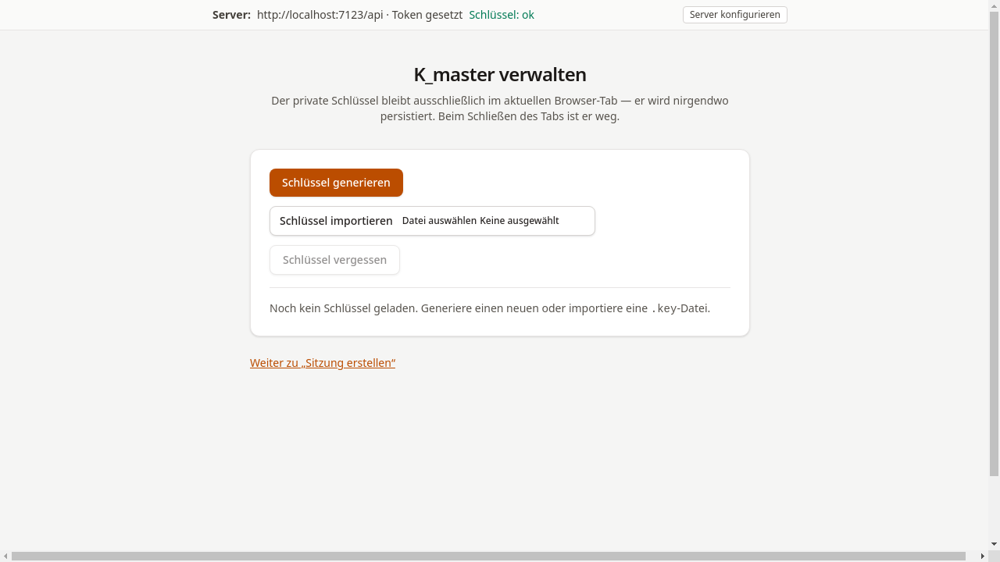

# Schlüssel anlegen

## Ziel

Hier wird der persönliche Institutsschlüssel (K_master) generiert.
Er ist die Wurzel des gesamten Vertrauensmodells: Aus ihm wird für
jede Kurssitzung automatisch ein eigener Sitzungsschlüssel abgeleitet —
jeder Kurs hat damit seinen eigenen kryptographischen Schlüssel, ohne
dass K_master jemals den Browser verlässt.

## Schritt-für-Schritt

1. Die Tutor-Konsole unter `/tutor/` aufrufen und auf
   **Schlüssel öffnen** klicken — oder direkt zu `/tutor/keys` navigieren.

    

2. Auf **Schlüssel generieren** klicken. Das System erzeugt einen
   neuen Ed25519-Schlüssel direkt im Browser und bietet ihn
   als `.key`-Datei zum Download an. Diese Datei ist sicher aufzubewahren.

3. Nach der Generierung zeigt die Seite den
   [Fingerabdruck](../glossar.md#fingerabdruck-fingerprint) (BLAKE2b-256)
   des Schlüssels an.

    

!!! warning "Hinweis"
    Der Schlüssel ist ausschließlich im aktuellen Browser-Tab vorhanden.
    Beim Schließen des Tabs ist er unwiederbringlich verloren, sofern
    die `.key`-Datei nicht gesichert wurde.
    Siehe [Sicherheit: K_master](sicherheit-k-master.md).

## Was als Nächstes?

[Server verbinden](02-server-verbinden.md) — API-Zugangsdaten hinterlegen.
