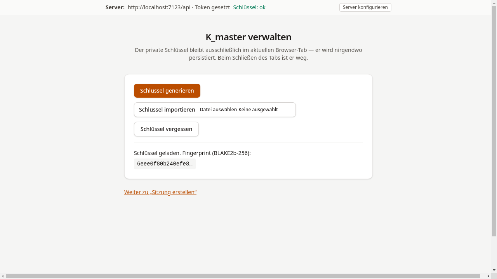

# Server verbinden

## Ziel

Hier werden die API-Adresse und das Bearer-Token hinterlegt,
damit die Tutor-Konsole mit dem Server kommunizieren kann.

## Schritt-für-Schritt

1. Am oberen Bildschirmrand befindet sich das **Server-Konfigurations-Panel**.
   Auf **Server konfigurieren** klicken, um das Formular aufzuklappen.

2. Die **API-Basis-URL** eintragen (z. B. `https://teilnahmebescheinigung.gra.one/api`)
   sowie das **Tutor Bearer-Token**, das vom Betreiber bereitgestellt wurde.

3. Auf **Speichern** klicken. Die Konsole ruft daraufhin den
   öffentlichen Serverschlüssel ab. Bei erfolgreicher Verbindung
   erscheint neben „Schlüssel:" der Status **ok**.

    

!!! warning "Hinweis"
    Falls der Status „Schlüssel: nicht erreichbar" angezeigt wird,
    sollte die API-URL überprüft und sichergestellt werden, dass der Server
    erreichbar ist. Ohne gültigen Serverschlüssel kann keine Sitzung
    erstellt werden.

## Was als Nächstes?

[Sitzung erstellen](03-sitzung-erstellen.md) — Kursdaten eingeben und
den Einschreibe-Link generieren.
