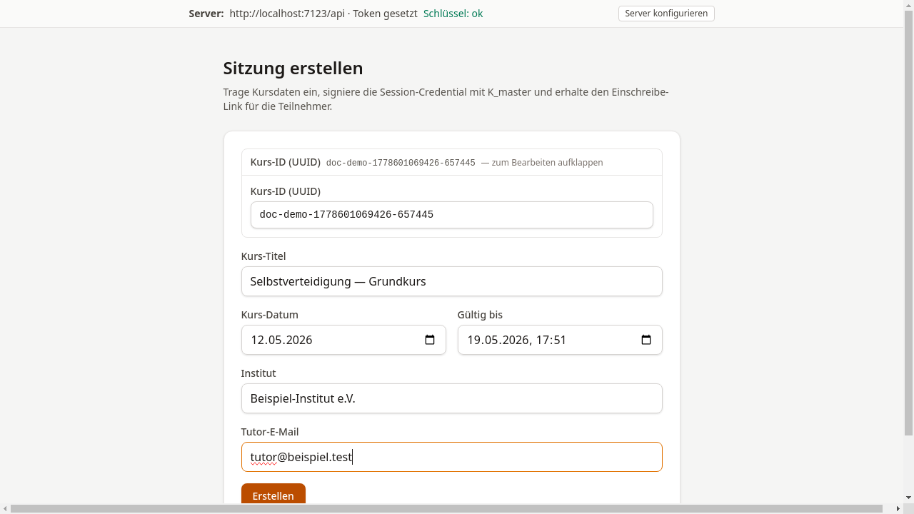
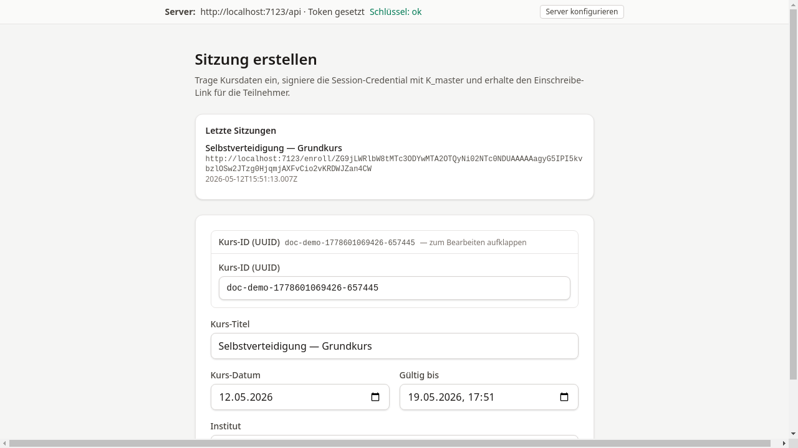

# Sitzung erstellen

## Ziel

Hier wird eine Kurssitzung angelegt und ein Einschreibe-Link generiert,
der an die Teilnehmenden weitergegeben werden kann.

## Schritt-für-Schritt

1. Zu `/tutor/sessions/new` navigieren oder auf der
   Startseite auf **Sitzung anlegen** klicken.

2. Das Formular ausfüllen:

    - **Kurs-Titel** — Name der Veranstaltung
    - **Kurs-Datum** — Durchführungsdatum
    - **Gültig bis** — Ablaufdatum des Einschreibe-Links
    - **Institut** — Name der ausstellenden Einrichtung
    - **Tutor-E-Mail** — E-Mail-Adresse für Benachrichtigungen

    

3. Auf **Erstellen** klicken. Die Konsole leitet aus K_master und den
   Sitzungsdaten (Kurs-ID, Datum) einen **eigenen Sitzungsschlüssel** für
   genau diesen Kurs ab. Dieser Sitzungsschlüssel signiert die Sitzung
   und wird verschlüsselt an die API übermittelt — K_master selbst
   verlässt den Browser dabei zu keinem Zeitpunkt.

4. Bei Erfolg erscheint der **Einschreibe-Link** mit einem
   **Kopieren**-Button.

    

!!! warning "Hinweis"
    Der Einschreibe-Link ist nur bis zum eingetragenen
    „Gültig bis"-Datum nutzbar. Danach erhalten Teilnehmende
    die Meldung „Anmeldefenster geschlossen".

## Was als Nächstes?

[Liste drucken](04-liste-drucken.md) — Klassische Druckbescheinigungen erstellen.
Oder den Einschreibe-Link direkt an die Teilnehmenden weitergeben.
