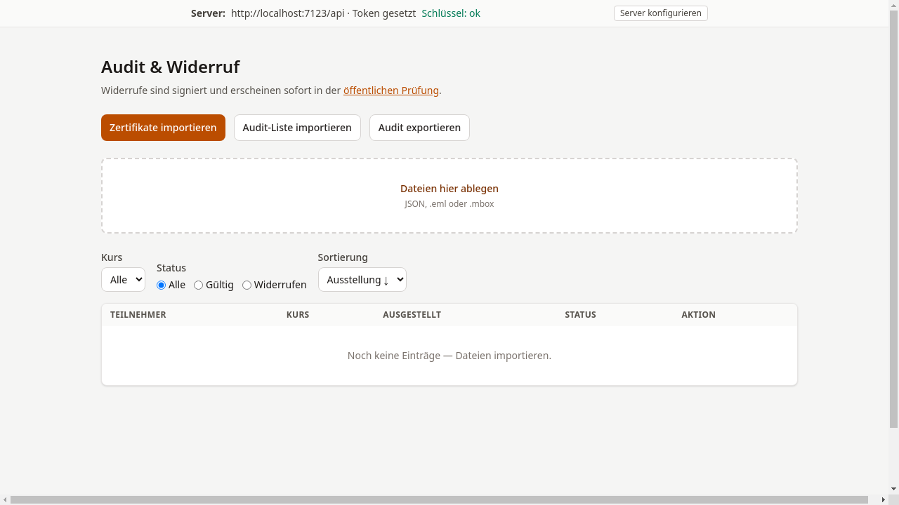
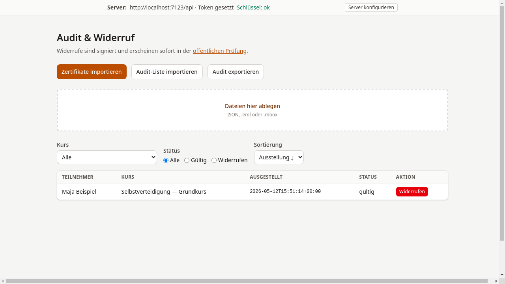
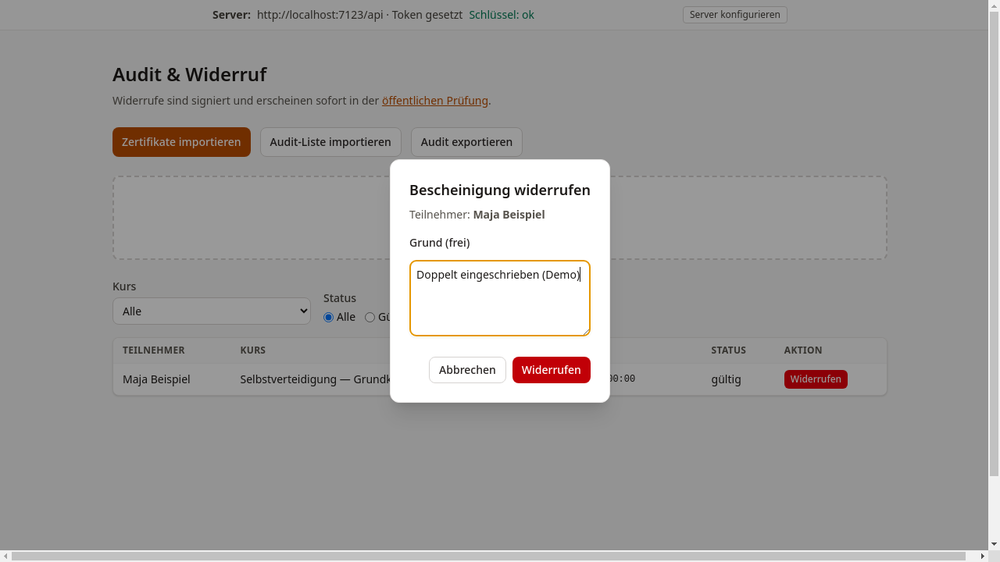
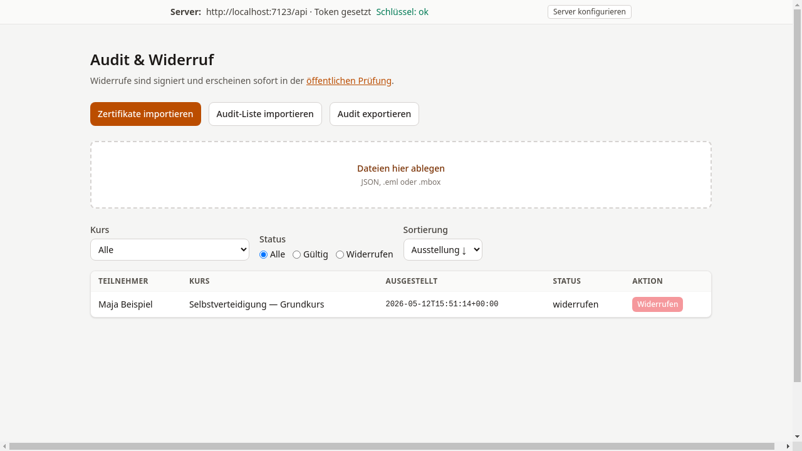

# Audit & Widerruf

## Ziel

Hier verschafft man sich einen Überblick über alle importierten
Bescheinigungen und kann einzelne Bescheinigungen bei Bedarf
widerrufen.

## Schritt-für-Schritt

1. Zu `/tutor/audit` navigieren oder auf der
   Startseite auf **Vorschau** klicken.

    

2. Bescheinigungen über **Zertifikate importieren** einlesen
   (JSON-Dateien, `.eml`- oder `.mbox`-Dateien per Dateiauswahl oder
   Drag & Drop). Die importierten Einträge erscheinen in der
   Übersichtstabelle.

    

3. Bei Bedarf nach Kurs oder Status filtern (Alle / Gültig /
   Widerrufen).

4. Um eine Bescheinigung zu widerrufen, in der jeweiligen Zeile auf
   **Widerrufen** klicken. Ein Dialog öffnet sich, in dem ein Grund
   eingegeben werden kann.

    

5. Nach Bestätigung signiert das System den Widerruf mit K_master
   und sendet ihn an den Server. Der Status wechselt zu
   „widerrufen".

    

!!! warning "Hinweis"
    Ein Widerruf ist endgültig und sofort auf der öffentlichen
    Prüfseite sichtbar. Es sollte sichergestellt sein, dass der Widerruf
    berechtigt ist, bevor er bestätigt wird.

!!! danger "Datenverlust-Risiko"
    Widerruf-Einträge liegen ausschließlich in der Datenbank des Servers.
    Das System versendet beim Widerruf **keine Bestätigungs-E-Mail** —
    es gibt also keine automatische externe Kopie des Widerrufsdokuments.
    Geht der Server ohne Backup verloren, sind alle Widerruf-Einträge weg —
    die betroffenen Bescheinigungen würden danach bei einer Online-Prüfung
    wieder als gültig erscheinen.

    **Empfehlung:** Widerrufe zusätzlich außerhalb des Systems festhalten
    (z. B. schriftlich dokumentieren oder das Widerrufsdokument aus der
    Audit-Ansicht exportieren) und den Betreiber auf regelmäßige
    Datensicherungen hinweisen. Eine systeminterne Lösung — etwa ein
    E-Mail-Versand des signierten Widerrufsdokuments an die Tutor-Adresse —
    ist noch nicht implementiert.

## Was als Nächstes?

[E-Mail-Vorschau (Mailpit)](06-mailpit-vorschau.md) — Im Testbetrieb
die ausgehenden Benachrichtigungs-E-Mails einsehen.
