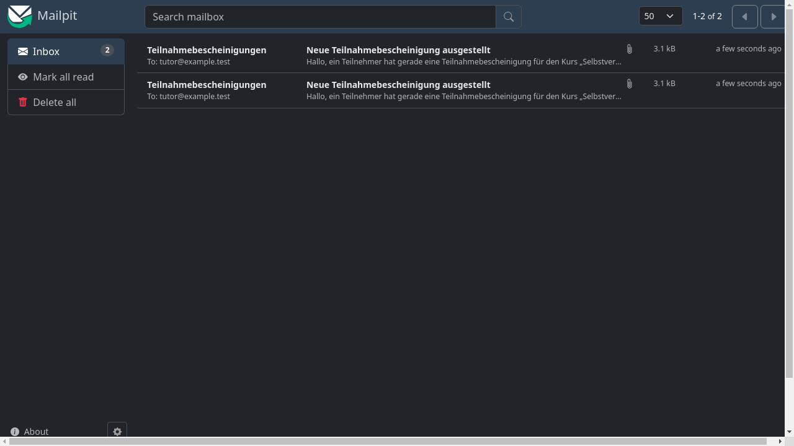
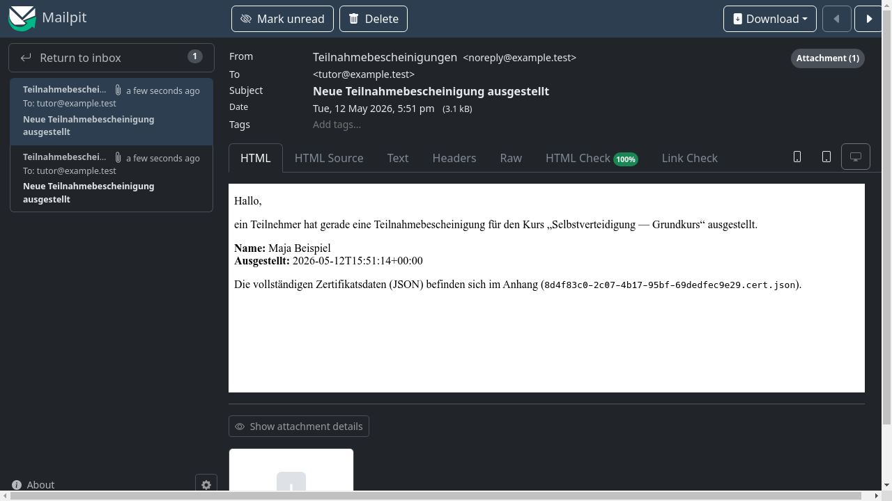
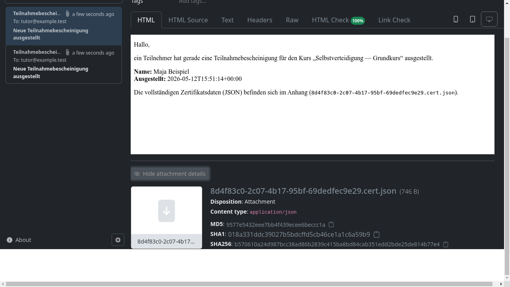

# Ausgehende E-Mails

Das System versendet automatisch E-Mails — etwa Benachrichtigungen
an die Tutor:in nach dem Ausstellen einer Bescheinigung. Diese Seite
zeigt, welche E-Mails das System verschickt und wie sie aufgebaut sind.

## Posteingang

Im Posteingang sind alle vom System versendeten Nachrichten aufgelistet,
mit Betreff, Empfänger und Sendezeitpunkt.

## Nachrichtenansicht

Ein Klick auf eine Nachricht öffnet die Detailansicht mit Betreff,
Absender, Empfänger und dem vollständigen Nachrichtentext.

## Anhänge

Falls die Nachricht Anhänge enthält (z. B. die Bescheinigungsdatei),
werden diese im unteren Bereich aufgelistet.

!!! info "Darstellung in dieser Dokumentation"
    Die Screenshots zeigen die E-Mails in Mailpit, einem lokalen
    Mail-Testserver, der in der Entwicklungsumgebung eingesetzt wird.
    Im Produktivbetrieb landen die E-Mails natürlich im echten Postfach
    des Empfängers — Inhalt und Aufbau sind identisch.

## Was als Nächstes?

[Sicherheit: K_master](sicherheit-k-master.md) — Warum der Schlüssel
nur im Browser-Tab vorhanden ist.
