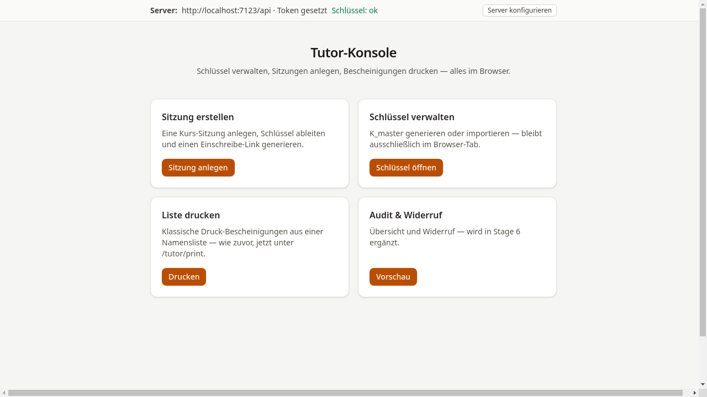

# Tutor:in

Tutor:innen erstellen kryptographische Bescheinigungen für Kursteilnehmende.
Der gesamte Vorgang läuft im Browser ab — der private Schlüssel verlässt
zu keinem Zeitpunkt den aktuellen Browser-Tab.

## Ablauf

1. [Schlüssel anlegen](01-schluessel-anlegen.md) — K_master generieren
2. [Server verbinden](02-server-verbinden.md) — API-URL und Token hinterlegen
3. [Sitzung erstellen](03-sitzung-erstellen.md) — Kursdaten eingeben, Einschreibe-Link erhalten
4. [Liste drucken](04-liste-drucken.md) — Klassische Druckbescheinigungen (optional)
5. [Audit & Widerruf](05-audit-und-widerruf.md) — Bescheinigungen prüfen und ggf. widerrufen
6. [E-Mail-Vorschau (Mailpit)](06-mailpit-vorschau.md) — Ausgehende E-Mails im Testbetrieb einsehen

