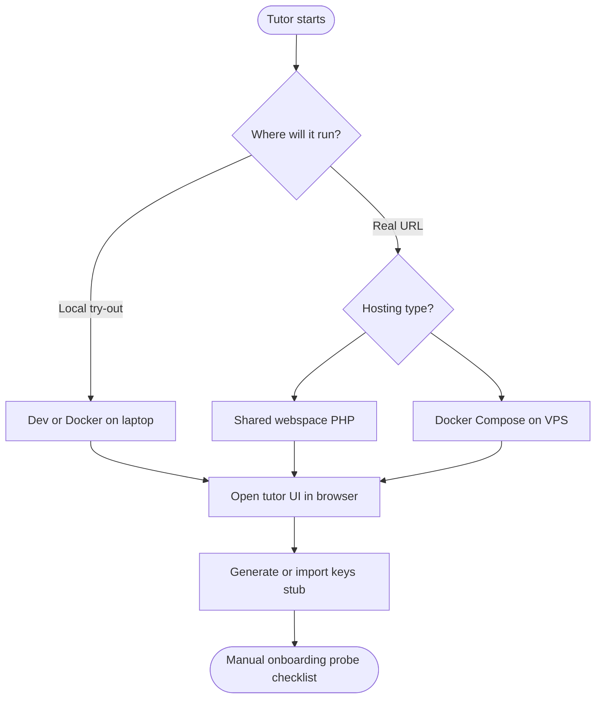
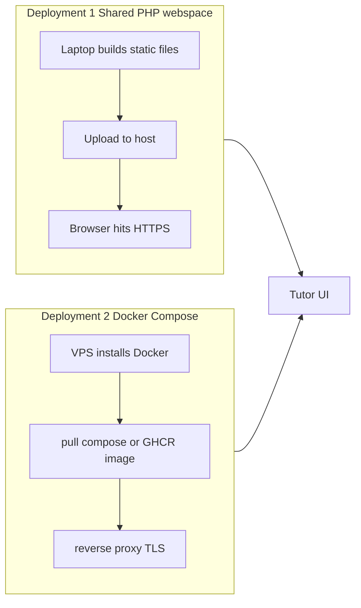

# Plan — tutor onboarding handbook (documents + contents)

Target reader: **a single tutor** with light technical confidence who wants **~10 minutes** from “nothing” to **“I can reach the tutor UI + I know where my keys belong”**.  
Tone: step-by-step, “by the hand” — numbered checks, single happy path first, pitfalls in short callouts.

This file is **only the plan**: it lists **which documents we will create** and **what each will contain**. Once the product is closer to shipped, authors fill those files and we **manually run through** onboarding to validate.

---

## End-user outcome (prototype scope)

Until the full certificate flow exists, “ready” means:

1. Tutor can **open the tutor app** in a browser (dev, Docker, or deployed host).
2. Tutor understands **where keys will live** and has run (or will run) **one key-generation path** we document.
3. Tutor knows **which deployment path** matches their hosting (shared PHP **or** Docker Compose).

---

## Happy path (conceptual)

---

## Documents to create (inventory)

All paths under **`doc/onboarding/`** unless noted.

| File | Audience | Purpose in one sentence |
|------|----------|-------------------------|
| [`README.md`](README.md) (this folder’s index) | Tutor | **Map**: pick deployment path → open the right guide; link glossary and plan. |
| [`quickstart-10-minutes.md`](quickstart-10-minutes.md) | Tutor | **Fast lane**: prerequisites, clone or release binary, **one** path to see `/tutor/` working, sanity URLs. |
| [`keys-explained-and-next-steps.md`](keys-explained-and-next-steps.md) | Tutor | **Keys without jargon**: tutor-held vs server, what “generate keys” will mean once implemented, safe storage, fake/example flow until UI exists. |
| [`deployment-shared-php-webspace.md`](deployment-shared-php-webspace.md) | Tutor | **Cheap hosting**: uploads, `public`/`index.php`, PHP version, no Node on server, SPA static files placement, HTTPS. |
| [`deployment-docker-compose.md`](deployment-docker-compose.md) | Tutor | **VPS / home server**: use repo `docker-compose.yml` or release image + [`deploy/`](../deploy/) Traefik-style compose; ports, env, updates. |
| [`manual-probe-checklist.md`](manual-probe-checklist.md) | Maintainer / tutor beta | **Checkbox list** to verify onboarding really works (time each step, note blockers). |

Optional later (not required for first probe):

| File | Note |
|------|------|
| `troubleshooting.md` | Only after we see real failure modes from probes. |
| `video-outline.md` | Script for a 5–8 min screen recording. |

---

## Planned content per document (concise)

### `README.md` (onboarding index)

- One paragraph: what this service will do (certificates, links) in plain language.
- **Choose your path** table: *I have only webspace* → link A; *I can run Docker* → link B; *I only want to try locally* → link quickstart.
- Links to product concept [`doc/plan/key-signing-courses-plan.md`](../plan/key-signing-courses-plan.md) for the curious (optional read).

### `quickstart-10-minutes.md`

- **Prerequisites** (short): browser, Git *or* zip from release, Docker *or* Bun (pick one track).
- **Track A — Docker (recommended for non-devs with Docker)**: `docker compose up`, open URL, see JSON + `/tutor/`.
- **Track B — Bun dev** (for devs): `bun install`, `bun dev`, open `localhost:3000`.
- **Done when**: three checkboxes (API responds, tutor UI loads, no mystery errors).
- Explicit **“not yet implemented”** box: issuing a real course link may still fail — that’s OK for probe v1.

### `keys-explained-and-next-steps.md`

- **Why keys** in one paragraph (signing, verification).
- Diagram (simple boxes): *Tutor device / browser* ↔ *Server stores only public / minimal state* (wording aligned with canonical plan when implemented).
- **How you will generate keys** (placeholder until UI exists):
  - *Planned*: in-browser flow in tutor app **or** export from a small local tool — state **TBD** and link to plan doc.
- **What to do today**: e.g. “skip generation” or “use placeholder button when available” + **do not** commit private keys to Git.
- Link to security hygiene (backup, passphrase if applicable — only if product requires it).

### Deployment part 1 — `deployment-shared-php-webspace.md`

*For tutors with **classic web hosting** (PHP, FTP/SFTP, no containers).*

- Requirements: PHP version (match project), HTTPS, writable dirs only if backend later needs them.
- Layout: analogy to **`api/public/`** — `index.php`, static SPAs under `static-spa/` (or subdomain split if host forces it).
- Build on **your laptop**: run `build:compose` (or download release artifact if we publish zips later) → upload artefacts.
- **No Mailpit**, no dev endpoints in production uploads.
- Common hosts: subdirectory vs subdomain (short note).

### Deployment part 2 — `deployment-docker-compose.md`

*For tutors who can run **Docker** on a small VPS or NAS.*

- Two sub-options, both short:
  1. **Dev-style stack**: repo `docker-compose.yml` — good for tinkering (includes Mailpit; document “turn off Mailpit for real prod”).
  2. **Production-style**: GHCR image from release + Traefik/`deploy/` files — link [`deploy/README.md`](../../deploy/README.md).
- **One command block** copy-paste each; firewall / DNS one-liner reminders.
- **Updates**: pull new tag, `docker compose up -d` (or equivalent).

### `manual-probe-checklist.md`

- Table: Step | Expected result | Actual | Time (min) | Notes.
- Rows mirror `quickstart` + both deployment intros.
- Explicit row: **Keys step** — “placeholder / blocked / works” until feature lands.

---

## Mermaid — deployment fork (for the handbook body later)

---

## Dependencies on product implementation

| Handbook section | Depends on |
|------------------|------------|
| Key generation screenshots | Tutor UX + crypto package |
| Exact upload tree for shared PHP | Final `public/` layout + build outputs |
| “Ten minutes” claim | Automated checks or fewer manual steps |

Until then, docs must label **prototype / forthcoming** clearly so onboarding probes don’t promise finished behavior.

---

## Next action

1. Add empty stubs for the listed files (`README.md` + placeholders) **or** keep only this plan until stakeholders agree on wording — **recommended**: create **`doc/onboarding/README.md`** stub linking here + “coming soon”.
2. Run **`manual-probe-checklist.md`** with a naive reader after first draft of **`quickstart-10-minutes.md`**.
